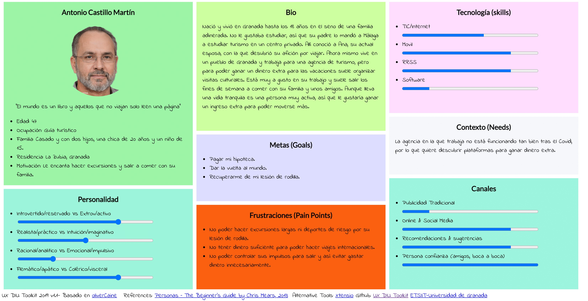
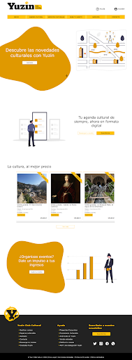

# Caso de estudio - Yuzin Club Cultural
Según su [web](https://yuzin.com/), Yuzin es una plataforma de divulgación y promoción de contenidos culturales que combina agenda cultural con marketplace de venta de entradas para espectáculos. Además, son un club cultural al que puedes asociarte para beneficiarte de descuentos y actividades exclusivas.

## Contexto

Yuzin nació en 2003 en Granada como una revista que distribuía mensualmente y en papel los eventos culturales que se ofrecían en la ciudad. Posteriormente, se extendería hasta Sevilla y Málaga, consiguiendo posicionarse como una de las agendas culturales mejor valoradas de la comunidad autónoma.
En el año 2020, en plena pandemia, deciden realizar un cambio de orientación de su negocio, transformándose en una web que ofrece una agenda cultural junto con un marketplace de entradas. Esto permite que se pueda acceder de una forma más dinámica a la información, además de crear una comunidad que pone en contacto gente interesada en la cultura andaluza con promotores de eventos. 

Tras una situación en la que la cultura se ve muy afectada, me parece un cambio de planteamiento muy acertado, puesto que da solución a un problema actual: la promoción de la cultura. Además, encaja muy bien con lo que lleva haciendo hasta este momento, y la digitalización de la revista les permite acercarse a más usuarios y a un público más joven. 
Su modelo de negocio se basa en suscripciones a la newsletter, permitiendo recibir la revista en físico y descuentos en entradas para eventos culturales, así como acceder a algunas exclusivas. Además, tanto en su página web como en la revista tienen publicidad.

## Proceso

Se pretende evaluar el rediseño de Yuzin y proponer una mejora. Para ello, seguiré los siguientes pasos:
- **(THINK)  Investigación:** se pretende estudiar cómo funciona el sistema actualmente, pensando en las personas que lo utilizan. Para ello haré una persona ficticia junto con un mapa de experiencia, para evaluar cómo un usuario potencial utiliza la solución web actual. Evaluaré la usabilidad de la misma basándome en la experiencia obtenida y así podré ver sus puntos fuertes y débiles, que me servirán para criticar el diseño actual y poder mejorarlo.

- **(MAKE)   Ideación:** en esta etapa se pretende empezar a diseñar un producto mejorado. Para ello antes, la ideación me ayudará a analizar las ideas y tareas esenciales del proyecto. Utilizaré una malla receptora de información para conseguirlo, así como un mapa que represente la arquitectura de información actual del sitio, para poder ver posibles fallos en su estructura. Se aportará un nuevo mapa que responda a estos fallos básicos.
- **(MAKE)   Prototipado:** con toda esta información se planteará un prototipo en versión de alta fidelidad o HiFi de algunas de las partes más críticas y peor ejecutadas del diseño actual.

- **(CHECK) Evaluación:** pretende emular una fase de evaluación con usuarios o expertos. Compararé ambos diseños y explicaré por qué mejoran la experiencia del usuario. Además, se añadirá un informe de accesibilidad del sitio actual, para tomar esos problemas en una nueva implementación.

## Investigación
Tras analizar la página web y la revista de Yuzin, se considera estudiar sus potenciales usuarios y las tareas críticas del sistema para evaluar su usabilidad y conseguir descubrir sus puntos fuertes y débiles. 

### Diseño de persona ficticia
La renovación de Yuzin incluye como aspecto novedoso el marketplace de eventos turísticos y su comunidad cultural. Se puede observar a simple vista que la revista tiene cierta madurez, dado que lleva 18 años funcionando. Es por eso que la adaptación de los clientes lectores a una revista de tipo digital es menos crítica, dado que el modelo digital cada vez es más popular y la revista sigue entregando ejemplares en físico.
Sin embargo, la figura que aparece nueva, del promotor cultural parece que pueda ser más novedosa para la empresa. Es por ello que se decide realizar una persona ficticia que encaje dentro de este papel. 
Así, se crea a Antonio Castillo Martín, un guía turístico granadino de 47 años. Se encuentra casado y tiene 2 hijos, con los que disfruta mucho saliendo a comer y haciendo escapadas. Le encantaría tener más dinero para poder viajar más y pagar su hipoteca, sin embargo le cuesta ahorrar porque es tan activo y extrovertido que le cuesta decir que “no” a una quedada. Quizás Yuzin podría ser una buena fuente de ingresos extra para Antonio.

### Mapa de experiencia de usuario
Se evaluará el escenario en el que Antonio toma contacto con Yuzin por primera vez. Lo descubre gracias a un compañero de trabajo, y, tras ver la revista, se decide a ingresar en la plataforma como promotor. No ha sido un proceso sencillo, pero dado que se fía mucho de las recomendaciones de personas de confianza lo intentará hasta conseguirlo. Parece que sólo le queda esperar a ver si el primer evento que ha publicado es comprado por algún usuario, pero tiene dudas tras ver cómo funciona la plataforma y la borrosidad de la información de la misma.

### Revisión de usabilidad

Ver [aquí](https://github.com/JesusGonzalezA/CaseStudy-Yuzin/blob/master/Archives/UsabilityReview.pdf) el informe completo.

Tras hacer la revisión de usabilidad, la página web obtiene una nota de **63** sobre 100. Esto significa que la usabilidad de la misma es **moderada**: los usuarios pueden utilizar el sitio web y completar la mayoría de tareas. Sin embargo, se puede trabajar mucho en que esta experiencia sea más positiva para los mismos. 
Cabe hacer mención a los resultados alojados en algunas secciones:

- Página inicial: la información no es clara y es difícil como usuario enterarse de lo que es Yuzin. Además, las secciones no están bien delimitadas.
- Navegación: cabe destacar que la navegación es inconsistente, debido a que el labelling de los enlaces de la barra de navegación y el footer no coincide. Además, en su versión móvil no aparece y los usuarios no pueden utilizarla.
- Contenido: es la sección en la que más nota se le ha dado a Yuzin. Esto puede ser debido a que está muy trabajado desde su versión analógica.
- Ayuda: es la sección en la que menos nota se le ha dado. Esto es debido a que carece de la misma, a pesar de tener el contacto disponible.

## Ideación
Tras investigar a los potenciales usuarios de Yuzin y la usabilidad de la web se podrían destacar los puntos fuertes que se desean mantener en la nueva propuesta de diseño y así poder centrarla en reforzar aquellos aspectos que merman la experiencia de usuario.

### Malla receptora de información
Gracias a la malla receptora de información se han podido analizar los puntos fuertes de la aplicación, como son los precios exclusivos que consiguen mediante acuerdos, la digitalización de un medio maduro y la variedad de actividades que se ofrecen.
También se consigue obtener algunas preguntas que los usuarios se pueden hacer, basados también en la persona creada anteriormente (Antonio). Algunas destacadas son: ¿qué requisitos tengo que cumplir para ser promotor? o ¿quién es mi guía y si merece la pena realizar esa actividad y con él?
Ante esto, se plantea trabajar en los aspectos negativos de la misma ( no hay ayuda, la navegación no funciona en móvil, etc ) y dar respuesta a las preguntas planteadas anteriormente, añadiendo valoraciones, descripción y comentarios de los guías y eventos.

### Arquitectura de información
No se pretende realizar en detalle un esquema de arquitectura de información, sino analizar los problemas que, a simple vista, nos ofrece la misma. Además, se ofrece una solución que responda a estos y que permitan mejorar la experiencia de usuario y realizar un prototipo HiFi a partir una base que resuelva algunas cuestiones de diseño básicas.

#### Actual
Viendo el esquema actual de navegación de la página, observamos que en la página principal tenemos acceso a:
- Opiniones
- Eventos destacados
- Búsqueda de eventos
- Barra de navegación que nos da acceso a:
    - Agenda cultural
    - Espacios culturales
    - Sube un evento
    - Descargar revista
    - Asóciate
    - Contacta
    - Acceder

De este esquema, podemos concluir:
- La página principal está saturada y no nos indica información si no conocemos el proyecto de por qué deberíamos de utilizarlo.
- Sólo podemos registrarnos cuando pagamos un evento.
- Cuando una persona se registra, quizás no conoce de las ventajas de ser un usuario premium.

#### Nuevo

Este esquema pretende resolver las cuestiones comentadas anteriormente,  así:
- Nada más registrarse damos información al usuario de los planes de la web.
- Del registro podemos ir al inicio de sesión y viceversa, siendo muy intuitivo por ser el estándar.
- Registrarse o iniciar sesión es un requisito del pago, así, si intentamos pagar, nos mandaría a la pantalla de inicio de sesión y sino estamos registrados podríamos crearnos una cuenta.
- En la pantalla de inicio se incluye lo más destacado, como eventos y artículos de opinión recientes. Además se pretende añadir información que permita a usuarios nuevos conocer por qué deberían utilizar este sistema.

## Prototipado

### Paleta de colores

Algunas combinaciones utilizadas con la misma no son accesibles, dado que no cumplen con los requerimientos de contraste WCAG 2.1 AA. Se detallará en el diseño Hi-Fi su resolución.

### Prototipo de alta fidelidad - Hi-Fi
He realizado un prototipo de alta fidelidad de la página principal de Yuzin, dado que creo que es la que se presta a los errores de diseño que más pueden reducir la experiencia de usuarios. 

[Ver el diseño Figma](https://www.figma.com/file/M9rnI8I872eW8qKjSMgSBy/Yuzin?node-id=13%3A2)

[Ver la ejecución en Figma](https://www.figma.com/proto/M9rnI8I872eW8qKjSMgSBy/Yuzin?node-id=13%3A2&scaling=min-zoom&page-id=7%3A2)

Nada más entrar, podemos ver una página con un aspecto mucho más moderno. Caben destacar varias cosas:
- La barra de navegación ocupa todo el ancho de la página. Se puede quedar fijo cuando se haga scroll para facilitar la navegación.
- Los colores de los enlaces de la barra de navegación tienen el suficiente contraste.
- Se incluye un botón de ayuda.
- Una frase atractiva junto a un botón para asociarse nada más entrar.
- No bombardeamos al usuario con demasiada información, le invitamos a hacer scroll.

Continuamos con tres secciones bien definidas de lo que ofrece la web:
- Revista, ahora en formato digital.
- Eventos culturales, dirigido a los potenciales clientes.
- Si interesa, añadimos un botón de ver más, en vez del filtro que nos lleva a la página de eventos como en la actual.
- Subir eventos, dirigido a los potenciales creadores de contenido o promotores de eventos.

Finalmente un footer en el que: 
- Los enlaces coinciden con la barra de navegación.
- Aparecen las redes sociales
- Para suscribirse a la newsletter, si el usuario ha iniciado sesión simplemente se suscribe. Sino, se le pide iniciar sesión.

Cabe destacar que se ha retirado el apartado de artículos de opinión, ya que no parece demasiado atractivo para los usuarios y tenerlo en un lugar tan importante hace que perdamos de vista lo que realmente es Yuzin. Aunque se debería de consensuar con el equipo de Yuzin, recomendaría añadir un apartado a modo de blog, en el que se incluya todo este contenido o al final de la revista de cada mes.

## Evaluación

### Accesibilidad
Parece interesante, ya que tenemos un rediseño de la web, ver qué fallos de accesibilidad tiene la actual para poder reimplementarla teniendo en cuenta estos errores ya cometidos.
Para ello he utilizado la herramienta Tawdis, que nos ofrece un informe automático del sitio. Para poder comparar, además he utilizado Lighthouse, que nos permite hacer informes de accesibilidad y otras características.

*Informe Tawdis*

*Informe Lighthouse*

#### Resultados del test
Cabe destacar algunas mejoras urgentes a realizar:
- Algunos elementos no tienen texto alternativo. Debe añadirse.
- Inputs sin su label correspondiente.
- Botones sin un nombre accesible.
- Links sin nombre.
- El uso del amarillo sobre el fondo blanco no tiene un contraste suficiente.

### Retrospectiva
Volviendo atrás a la persona ficticia, Antonio, gracias a este rediseño su experiencia de usuario se podría haber visto gratamente mejorada. 
El usuario, al entrar en la página, ve que Yuzin se dedica a trabajar con la novedad cultural, pero quiere ver en qué sentido concretamente por lo que continua leyendo. Ve que llevan años trabajando en el sector en forma de revista, que ahora se ha digitalizado y ve cómo los usuarios pueden beneficiarse con ellos. Parece interesante, ¿pero será para él que es un guía turístico?
Ve que gracias a ellos puede organizar eventos y ganar dinero extra, así que se decide por pinchar en el botón de asóciate ya y esperar que todo vaya sobre ruedas. ¡Misión cumplida!
