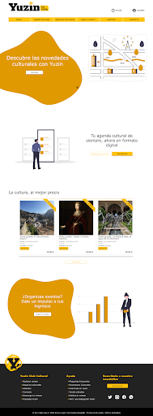

# Diseño de interfaces de Usuario 2021

Examen final de la asignatura DIU de la Universidad de Granada.

## Competencias

Puede ver [aquí](https://github.com/JesusGonzalezA/CaseStudy-Yuzin/blob/master/Competencias.md) la solución a la primera parte del examen, en la que se analizan las competencias adquiridas en la asignatura.

## Caso de estudio - Yuzin

Según su [web](https://yuzin.com/), Yuzin es una plataforma de divulgación y promoción de contenidos culturales que combina agenda cultural con marketplace de venta de entradas para espectáculos. Además, son un club cultural al que puedes asociarte para beneficiarte de descuentos y actividades exclusivas.

## Objetivo 

Se pretende evaluar el rediseño realizado por Yuzin para su página web y incluir aspectos de mejora.

## Resultado 

Mire [aquí](https://github.com/JesusGonzalezA/CaseStudy-Yuzin/blob/master/CaseStudy.md) el caso de estudio completo.

